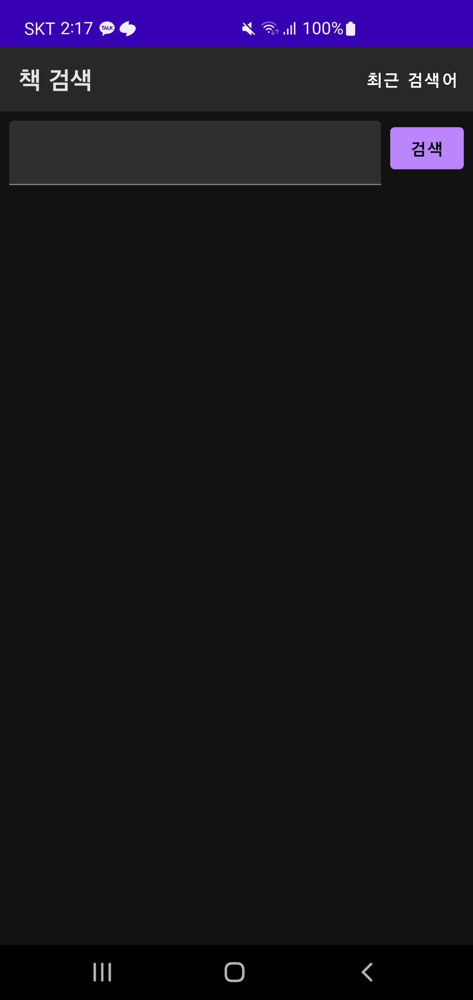
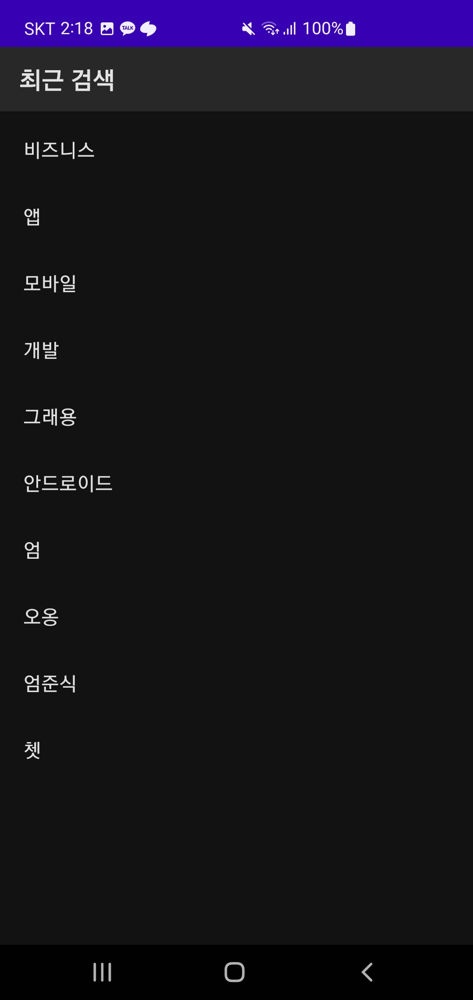
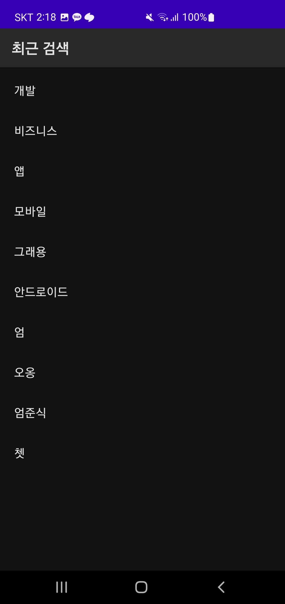

# SearchBooks
마드라스체크 개발 과제입니다.

<br>

## 프로젝트 구조
**MVVM, Clean Architecture**로 설계했습니다.  

```
 ┌─ common
 │     └─ Constants.kt
 │
 ├─ data
 │     ├─ local
 │     │    └─ entity
 │     ├─ paging
 │     ├─ mapper
 │     ├─ remote
 │     │    ├─ api
 │     │    └─ dto
 │     └─ repository
 │          └─ local
 │     
 ├─ domain
 │     └─ repository
 │          ├─ local
 │          │    └─ model
 │          └─ remote
 │               └─ model 
 └─ presentation
       ├─ di
       ├─ view
       │    ├─ navigation
       │    ├─ search_recent_screen
       │    │    ├─ view 
       │    │    └─ viewmodel 
       │    └─ search_screen
       │         ├─ model 
       │         └─ viewmodel 
       ├─ ui
       ├─ MainActivity.kt
       └─ SearchBookApplication.kt
```  

## 기능

### 메인 화면, 검색 화면, 웹 브라우저 화면
 

검색하면 책 검색 결과에 대해 리스트로 나타납니다.  
한 페이지에 **최대 10권**의 책을 보여주고, 스크롤을 내려 더 로드하게 되면 **Paging 라이브러리를 통해 10권의 책을 추가로 로드**합니다.  
리스트 내의 책을 터치하면 **웹 브라우저로 url을 로드**하여 보여줍니다.  

<br>

### 검색어 저장 화면  


검색어를 저장한 화면은 **Room 라이브러리**를 사용했습니다.  
```kotlin
@Query("SELECT DISTINCT searchWord FROM searchbookentity ORDER BY id DESC LIMIT 10")
```  
검색한 단어를 **내림차순과 중복을 제거한 상태로 10개를 로드**합니다.  

<br>

### 최근 검색어 이력으로 검색한 화면 및 검색어 저장 화면 갱신
  

최근 검색어 화면에서 검색어를 터치하면 **메인 화면으로 돌아오고, 검색어로 검색한 결과**를 보여줍니다.  
또한, 해당 검색어는 **제일 최상단에 위치**합니다.  

<br>


## Use Skills
* MVVM Pattern
* Clean Architecture
* Coroutine
* Flow, StateFlow, SharedFlow
* Hilt
* Gson
* Retrofit
* Room  
* Coil  
* Naver Book Search API  
* Duru API  